# けいさんカード の つかいかた

このページは、けいさんカードを はじめて ひらく人の ための つかいかたです。<ruby>画面<rt>がめん</rt></ruby>の <ruby>絵<rt>え</rt></ruby>と 見くらべながら、上から じゅんに <ruby>読<rt>よ</rt></ruby>んでください。

## はじめに ― けいさんカードで できること

けいさんカードは、小学1年生の「けいさんカード」を タブレットや パソコンで めくって れんしゅうする アプリです。この<ruby>章<rt>しょう</rt></ruby>では、なにが できるのかと、はじめる まえに よういする ものを せつめいします。

### どんな アプリか

ほんものの けいさんカードと おなじ 4つの いろの カードが、ぜんぶで 180まい 入っています。カードを めくって こたえて、ぜんぶ できるまでの タイムを はかります。

まちがえた カードは さいごに もう1かい 出てきます。ぜんぶ せいかいするまで <ruby>終<rt>おわ</rt></ruby>わりません。

<ruby>名前<rt>なまえ</rt></ruby>を 入れるところは ありません。ログインも いりません。

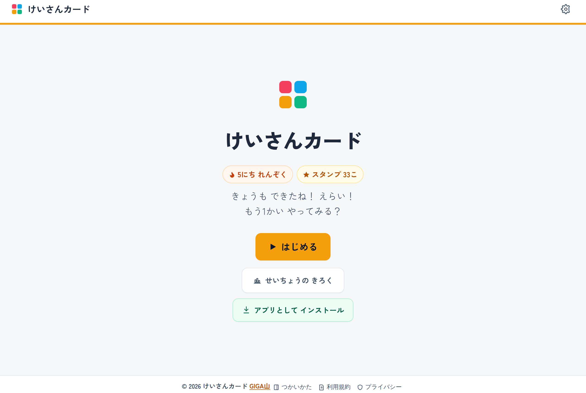

これが アプリを ひらいたときの <ruby>画面<rt>がめん</rt></ruby>です。

つぎのことは できません。カードを <ruby>紙<rt>かみ</rt></ruby>に すること、クラスの みんなの てんすうを あつめること、先生の <ruby>画面<rt>がめん</rt></ruby>から ひとりずつ 見ることです。

### つかう まえに よういするもの

つぎの 2つだけです。

- タブレットか パソコン（Chromebook・iPad・Windows のどれでも つかえます）
- 先生から おしえてもらった アドレス（https://keisan-card.giga-school.com/）

アカウントも ログインも いりません。1かい ひらいたあとは、<ruby>電波<rt>でんぱ</rt></ruby>が なくても つかえます。

はじめて ひらく ときだけ、<ruby>電波<rt>でんぱ</rt></ruby>の あるところで ひらいてください。

## さいしょの がめんの 見かた

アプリを ひらくと、いちばん さいしょに 出る <ruby>画面<rt>がめん</rt></ruby>です。ここから すべての ことを はじめます。

### まん中の 3つの ボタン

<ruby>画面<rt>がめん</rt></ruby>の まん中に、うえから じゅんに ボタンが ならんでいます。

- 「はじめる」… カードの れんしゅうを はじめます
- 「せいちょうの きろく」… いままでの タイムや れんしゅうした日を 見ます
- 「アプリとして インストール」… タブレットの ホーム<ruby>画面<rt>がめん</rt></ruby>に 入れます

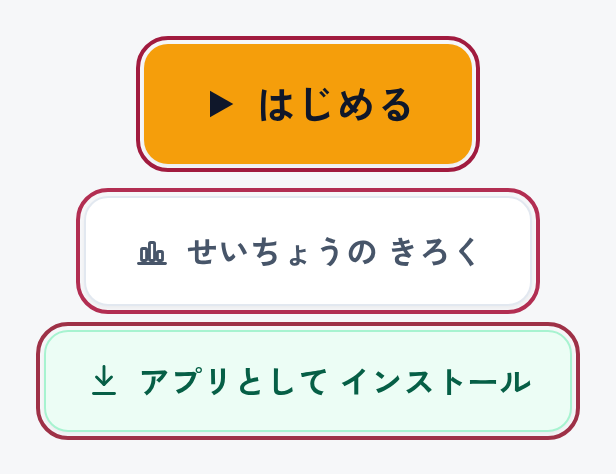

赤い わくで かこんだ ところです。

「アプリとして インストール」は、もう 入れたあとには 出なくなります。入れかたは あとの <ruby>章<rt>しょう</rt></ruby>で せつめいします。

### 上の おびと 下の おび

<ruby>画面<rt>がめん</rt></ruby>の いちばん 上と いちばん 下にも、ボタンが あります。

上の おびには、左に アプリの <ruby>名前<rt>なまえ</rt></ruby>、右に はぐるまの かたちの ボタンが あります。<ruby>名前<rt>なまえ</rt></ruby>を おすと、いつでも さいしょの <ruby>画面<rt>がめん</rt></ruby>に もどります。はぐるまは 「せってい」です。

左が さいしょの<ruby>画面<rt>がめん</rt></ruby>へ、右が せっていです。

下の おびには、「つかいかた」「<ruby>利用規約<rt>りようきやく</rt></ruby>」「プライバシー」の 3つの ならびが あります。「つかいかた」を おすと、いま <ruby>読<rt>よ</rt></ruby>んでいる この ページが ひらきます。

「つかいかた」は この ページに つながっています。

### きょうの ようす（れんぞくと スタンプ）

まいにち つづけていると、アプリの <ruby>名前<rt>なまえ</rt></ruby>の 下に まるい ふだが 出ます。

「◯にち れんぞく」は、まいにち つづけている 日の かずです。2日 いじょう つづいたときに 出ます。「スタンプ ◯こ」は、いままで クリアした かいすうです。

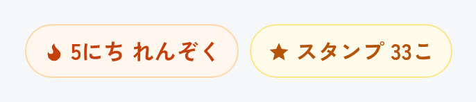

つづけていると、ここの <ruby>数<rt>かず</rt></ruby>が ふえます。

その下の ことばは、きょう もう れんしゅうしたかで かわります。まだのときは「けいさんカードを めくって、すらすら こたえよう。」、きょう もう できたときは「きょうも できたね！ えらい！」と 出ます。

## あか・あお・きいろ・みどりの カードを えらぶ

「はじめる」を おすと、カードの いろを えらぶ <ruby>画面<rt>がめん</rt></ruby>に なります。いろによって、出てくる しきが ちがいます。

### 4つの いろの カードと その 中み

4つの いろは、ほんものの けいさんカードと おなじ わけかたです。

- あかカード … たしざん（くりあがり なし）。こたえが 10までの しき。54まい
- あおカード … ひきざん（くりさがり なし）。ひかれる<ruby>数<rt>かず</rt></ruby>が 10までの しき。54まい
- きいろカード … たしざん（くりあがり あり）。こたえが 11から18の しき。36まい
- みどりカード … ひきざん（くりさがり あり）。ひかれる<ruby>数<rt>かず</rt></ruby>が 11から18の しき。36まい

ぜんぶ あわせて 180まいです。ならんでいる じゅんばんは いつも おなじなので、じぶんの すきな いろを おぼえておけます。

<ruby>画面<rt>がめん</rt></ruby>が ひろいときは 2つずつ よこに ならび、せまいときは たてに 1つずつ ならびます。どちらでも えらびかたは おなじです。

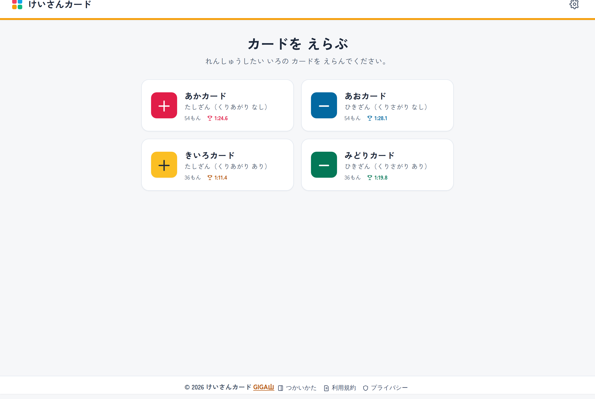

ひろい <ruby>画面<rt>がめん</rt></ruby>では 2つずつ ならびます。

### 1つの いろを えらぶ

れんしゅうしたい いろの ところを おします。

カードの <ruby>名前<rt>なまえ</rt></ruby>の 下には、その いろの まいすう（「54もん」など）が 出ます。1かいでも クリアしたことが あると、その よこに いちばん はやかった タイムも 出ます。

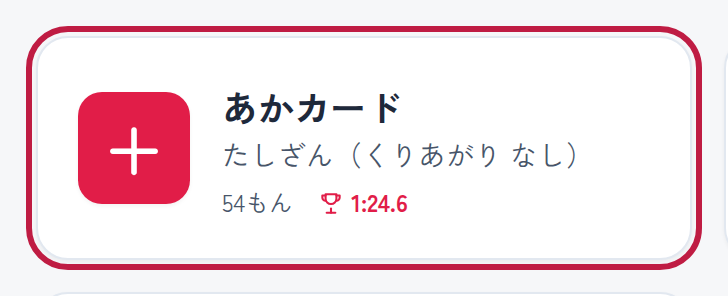

赤い わくの ところを おします。

【！】おぼえておくこと:

- ここに 出る タイムは、じゅんばんと バラバラの うち はやかった ほうです
- まだ 1かいも クリアしていない いろには、タイムは 出ません
- まちがえて ちがう いろを えらんでも、つぎの <ruby>画面<rt>がめん</rt></ruby>から もどれます

## じゅんばんと バラバラの モードを えらぶ

いろを えらぶと、つぎに 出かたを えらぶ <ruby>画面<rt>がめん</rt></ruby>に なります。おなじ カードでも、出る じゅんばんが かわります。

### じゅんばんと バラバラの ちがい

えらべるのは 2つです。

「じゅんばん」は、ちいさい しきから じゅんに 出ます。はじめは こちらで れんしゅうします。「バラバラ」は、まいかい ちがう じゅんばんで 出ます。じゅんばんを おぼえていなくても すらすら いえるかを ためせます。

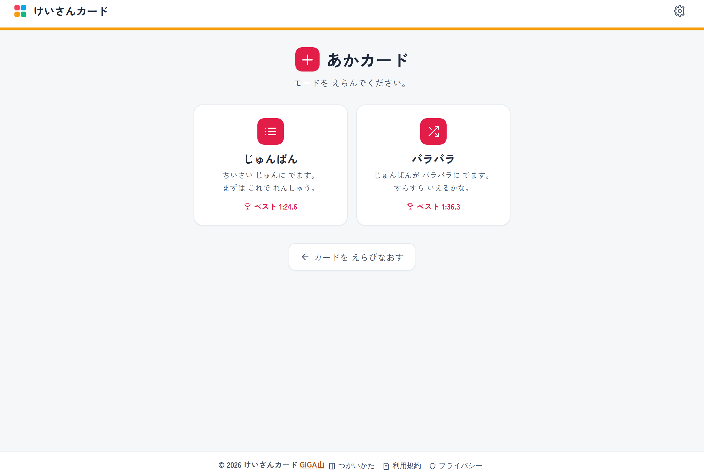

左が じゅんばん、右が バラバラです。

### モードを えらんで はじめる

やりたい ほうの ところを おすと、すぐに カードが はじまります。

それぞれの 下には、その モードの いちばん はやかった タイム（「ベスト」）が 出ます。まだ クリアしていない モードには 出ません。

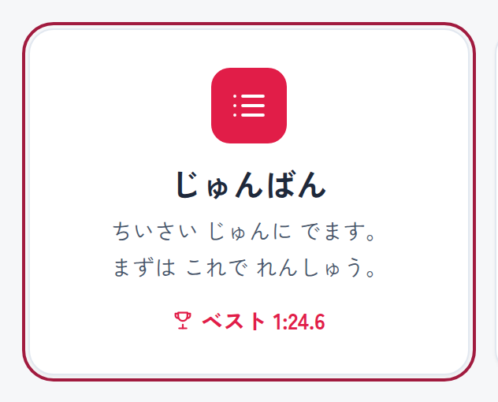

赤い わくの ところを おすと はじまります。

【！】おぼえておくこと:

- ベストの タイムは、いろ ごと・モード ごとに べつべつに のこります
- じゅんばんで はやくなってから バラバラを やると、ちがいが よく わかります
- おす まえの <ruby>画面<rt>がめん</rt></ruby>に もどりたいときは、下の「カードを えらびなおす」を おします

### えらんだ カードを かえたいとき

<ruby>画面<rt>がめん</rt></ruby>の いちばん 下に「カードを えらびなおす」が あります。

これを おすと、いろを えらぶ <ruby>画面<rt>がめん</rt></ruby>に もどります。まだ カードは はじまっていないので、タイムは はかられません。

## れんしゅう中の がめんの 見かた（タイム・のこり・すすみ<ruby>具合<rt>ぐあい</rt></ruby>）

モードを えらぶと、すぐに カードが 出て タイムが うごきはじめます。この<ruby>章<rt>しょう</rt></ruby>では、<ruby>画面<rt>がめん</rt></ruby>に 出る ものの 見かたを せつめいします。

### カードの おもてに 出る しき

まん中の 大きな カードが、いま こたえる しきです。

おもてには しきだけ、うらには こたえだけが 出ます。文字は <ruby>画面<rt>がめん</rt></ruby>の 大きさに あわせて 大きくなるので、<ruby>電子黒板<rt>でんしこくばん</rt></ruby>に つないでも うしろの せきから 見えます。

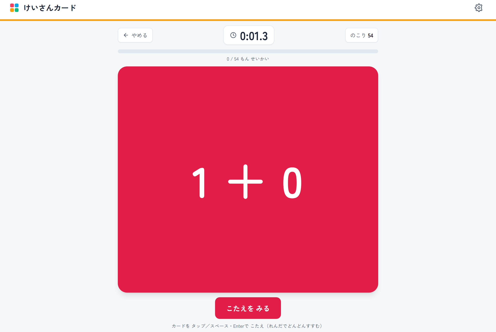

おもてには しきだけが 出ます。

### 上に ならぶ やめる・タイム・のこり

カードの 上に、3つの ものが ならんでいます。

- 左の「やめる」… とちゅうで やめて、さいしょの <ruby>画面<rt>がめん</rt></ruby>に もどります
- まん中の <ruby>時間<rt>じかん</rt></ruby> … はじめてからの タイムです。10<ruby>分<rt>ぶん</rt></ruby>の1<ruby>秒<rt>びょう</rt></ruby>まで うごきます
- 右の「のこり」… まだ せいかいしていない カードの まいすうです

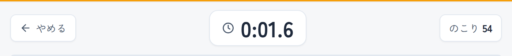

左から やめる、タイム、のこりです。

「のこり」は、せいかいするたびに 1つずつ へります。まちがえた カードは へらないので、そこで <ruby>止<rt>と</rt></ruby>まって 見えることが あります。

### すすみ<ruby>具合<rt>ぐあい</rt></ruby>の バーと 「なんもん せいかい」

3つの 下には、ほそい バーと 文字が あります。

バーは、せいかいした ぶんだけ 右に のびます。その 下の「◯ / ◯ もん せいかい」は、せいかいした まいすうと ぜんぶの まいすうです。

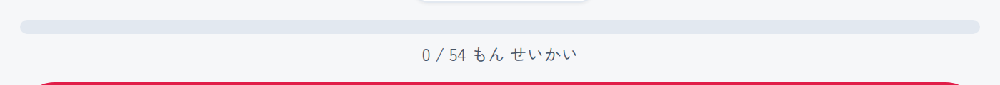

まだ 1もんも こたえていないところです。

## カードを めくって こたえる（3つの やりかた）

こたえかたは 3つ あります。どれを つかっても おなじです。じぶんの やりやすい ものを えらんでください。

### ゆびで タップして めくる

カードを 1かい タップすると、くるっと まわって こたえが 出ます。

こたえを 見てから、あっていたか まちがえたかを つたえます。こたえが 出る まえは、「わかった」も「もういちど」も おせません。かならず こたえを 見てから すすみます。

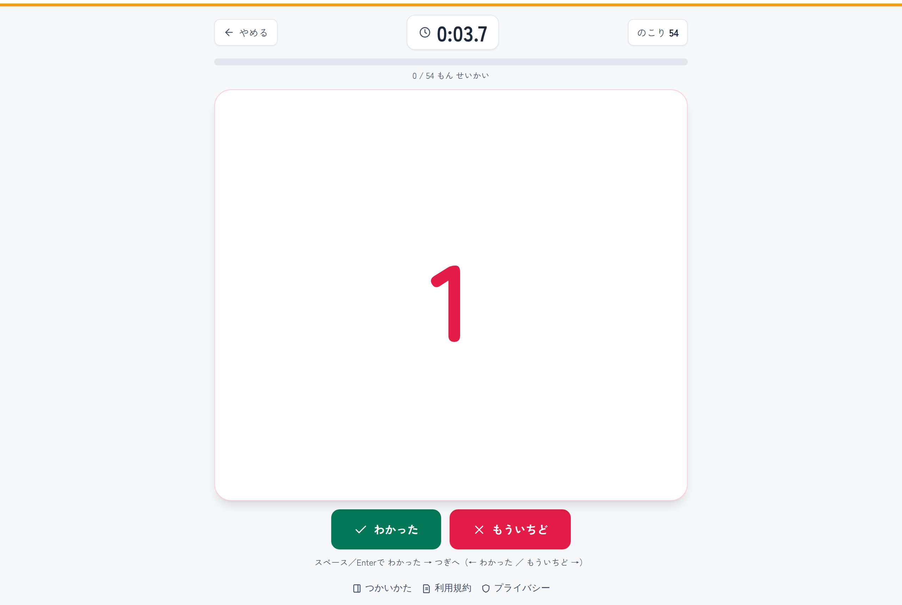

うらには こたえだけが 出ます。

### 左右に はらって こたえる

こたえが 出たあと、カードを ゆびで よこに はらうことが できます。

左に はらうと「わかった」、右に はらうと「もういちど」です。すこし うごかすと、カードの よこに みどりの「わかった」と 赤の「もういちど」が 出るので、どちらに 入れるか 見ながら ゆびを はなせます。

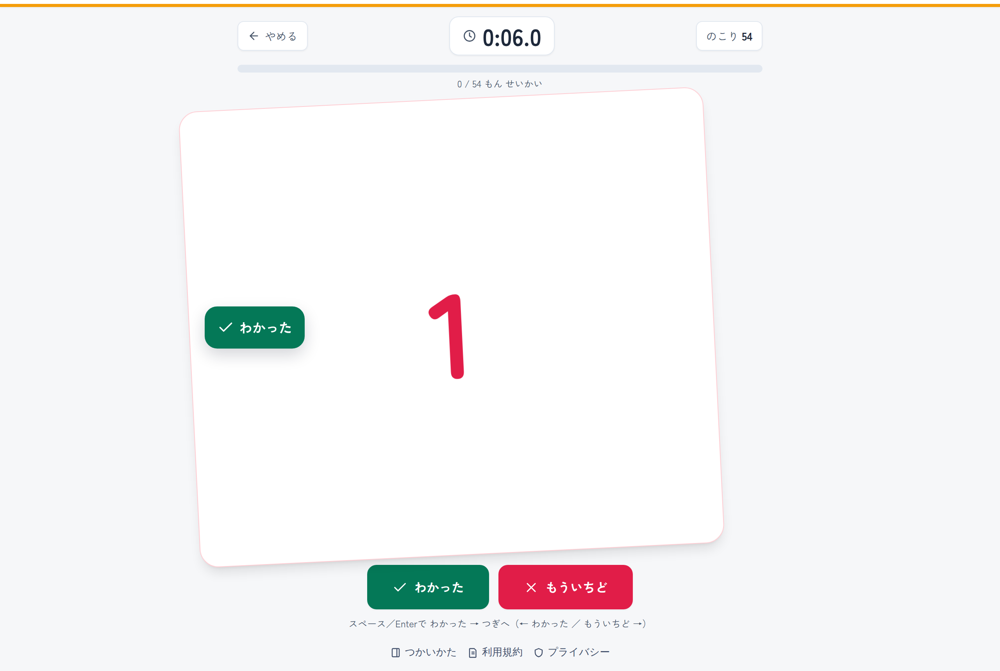

左に うごかすと みどりの ふだが 出ます。

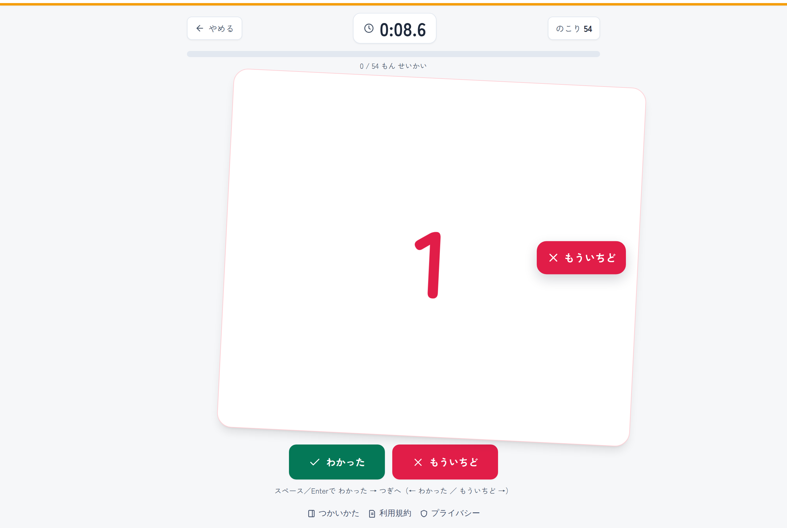

右に うごかすと 赤い ふだが 出ます。

とちゅうで 手を <ruby>止<rt>と</rt></ruby>めて、ゆびを もとに もどせば、なにも おきません。

### ボタンで こたえる

はらうのが むずかしいときは、下の ボタンを つかいます。

こたえが 出る まえは「こたえを みる」の 1つだけです。こたえが 出ると、みどりの「わかった」と 赤の「もういちど」の 2つに かわります。

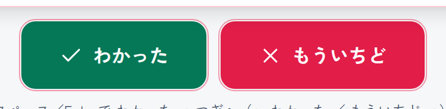

赤い わくの 2つを おして こたえます。

### キーボードで こたえる

パソコンや キーボードの ついた タブレットでは、キーボードだけでも すすめます。

- スペースキー か Enterキー … こたえを 出す。もう1かい おすと「わかった」で つぎへ
- ←（左むきの やじるし）… わかった
- →（右むきの やじるし）… もういちど
- ↑ ↓ … こたえを 出す

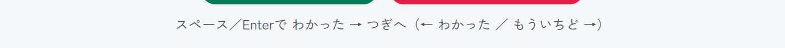

<ruby>画面<rt>がめん</rt></ruby>の 下に、いま つかえる キーが 出ます。

【！】おぼえておくこと:

- スペースキーを つづけて おすと、めくる と わかった を くりかえして どんどん すすみます
- キーを おしっぱなしにしても すすみません。1かいずつ おします
- 3つの やりかたは まぜて つかえます。とちゅうで かえても だいじょうぶです

## まちがえた カードと、とちゅうで やめる とき

このアプリは、ぜんぶ せいかいするまで <ruby>終<rt>おわ</rt></ruby>わりません。ここでは、まちがえた ときに どうなるかと、<ruby>時間<rt>じかん</rt></ruby>で <ruby>区切<rt>くぎ</rt></ruby>りたい ときの やめかたを せつめいします。

### まちがえた カードは さいごに もう1かい 出る

「もういちど」を えらんだ カードは、その<ruby>場<rt>ば</rt></ruby>では きえて、のこりの カードの あとに もう1かい 出ます。

まちがえた かずは、すすみ<ruby>具合<rt>ぐあい</rt></ruby>の 下に 赤い 文字で 出ます。この かずは、おなじ カードを 2かい まちがえたら 2に なります。

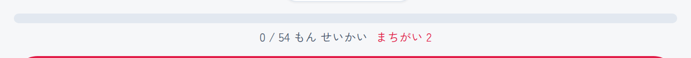

右がわに 赤く「まちがい」が 出ます。

せいかいするまで <ruby>何回<rt>なんかい</rt></ruby>でも 出てくるので、まちがえた カードが のこっている あいだは 「のこり」が へりません。こわれたわけでは ありません。

### 【！】とちゅうで やめる

<ruby>画面<rt>がめん</rt></ruby>の 左上の「やめる」を おすと、さいしょの <ruby>画面<rt>がめん</rt></ruby>に もどります。

じゅぎょうの <ruby>時間<rt>じかん</rt></ruby>で <ruby>区切<rt>くぎ</rt></ruby>りたい ときに つかってください。

【！】おぼえておくこと:

- とちゅうで やめると、タイムは のこりません。スタンプも ふえません
- こたえた ぶんは、<ruby>学習<rt>がくしゅう</rt></ruby>の <ruby>記録<rt>きろく</rt></ruby>には のこります（あとの <ruby>章<rt>しょう</rt></ruby>で せつめいします）
- タブレットの「もどる」を おしたときは、1つ<ruby>前<rt>まえ</rt></ruby>の「モードを えらぶ」<ruby>画面<rt>がめん</rt></ruby>に もどります

## ぜんぶ できたときの けっかの 見かた

カードを ぜんぶ せいかいすると、<ruby>紙<rt>かみ</rt></ruby>ふぶきが とんで けっかの <ruby>画面<rt>がめん</rt></ruby>に なります。この<ruby>章<rt>しょう</rt></ruby>では、そこに 出る <ruby>数字<rt>すうじ</rt></ruby>の 見かたを せつめいします。

### クリアタイムと ほめ<ruby>言葉<rt>ことば</rt></ruby>

いちばん 上に、ほめ<ruby>言葉<rt>ことば</rt></ruby>と、どの カード・どの モードを やったかが 出ます。

ほめ<ruby>言葉<rt>ことば</rt></ruby>は <ruby>何<rt>なに</rt></ruby>しゅるいか あって、クリアするたびに えらばれます。まえと おなじ ことばに なることも あります。その下には「スタンプ +1」の ふだが 出て、まちがいが 0だったときは「ぜんもん せいかい」の ふだも つきます。

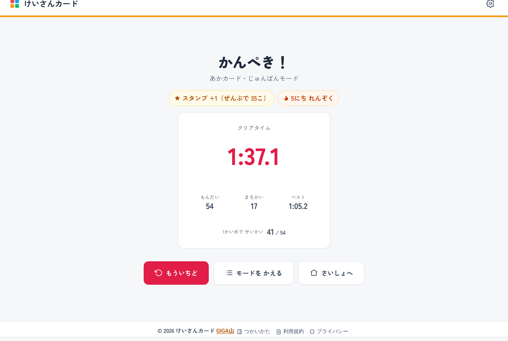

ぜんぶ できると この <ruby>画面<rt>がめん</rt></ruby>に なります。

### 5つの <ruby>数字<rt>すうじ</rt></ruby>の 見かた

まん中の 白い ところに、5つの <ruby>数字<rt>すうじ</rt></ruby>が 出ます。

- クリアタイム … こんかい かかった <ruby>時間<rt>じかん</rt></ruby>です
- もんだい … その カードの ぜんぶの まいすうです
- まちがい … 「もういちど」を えらんだ かいすうです
- ベスト … いままでで いちばん はやかった タイムです
- 1かいめで せいかい … 1かいめで こたえられた まいすうです

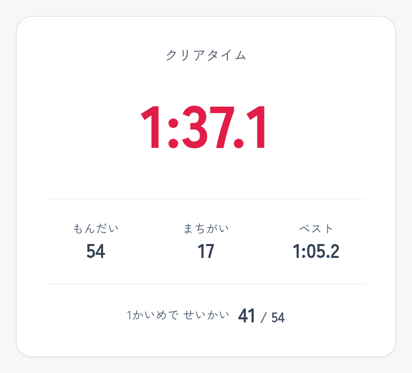

いちばん 下が「1かいめで せいかい」です。

このアプリは ぜんぶ せいかいするまで <ruby>終<rt>おわ</rt></ruby>わらないので、せいかいの かずは いつも まいすうと おなじに なります。じつりょくが よく わかるのは「1かいめで せいかい」の ほうです。

### しんきろくが 出たとき

いままでの ベストより はやく できたときは、いちばん 上に「しんきろく」の 文字が 出て、ほめ<ruby>言葉<rt>ことば</rt></ruby>も「しんきろく！ すごい！」に かわります。

<ruby>紙<rt>かみ</rt></ruby>ふぶきの かずも すこし ふえます。

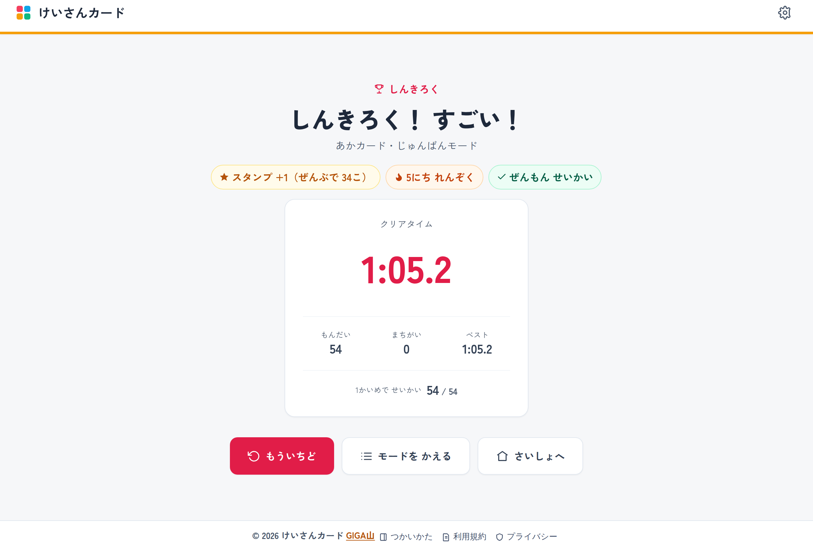

はやくなると この <ruby>画面<rt>がめん</rt></ruby>に なります。

### つぎに すすむ 3つの ボタン

いちばん 下の 3つの ボタンで、つぎに することを えらびます。

- 「もういちど」… おなじ カード・おなじ モードを もう1かい やります
- 「モードを かえる」… おなじ カードで じゅんばんと バラバラを かえます
- 「さいしょへ」… いちばん さいしょの <ruby>画面<rt>がめん</rt></ruby>に もどります

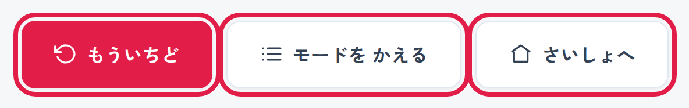

赤い わくの 3つから えらびます。

## せいちょうの きろくで じぶんの のびを 見る

さいしょの <ruby>画面<rt>がめん</rt></ruby>の「せいちょうの きろく」を おすと 見られます。じぶんが どれだけ つづけて、どれだけ はやくなったかが わかります。

### れんぞく・さいこう れんぞく・スタンプ

いちばん 上に、いままで <ruby>何回<rt>なんかい</rt></ruby> とりくんだかが 出ます。

その下の 3つの まるい ますは、左から じゅんに つぎの いみです。

- にち れんぞく … いま まいにち つづけている 日の かず。1日 あくと 0に もどります
- さいこう れんぞく … いままでで いちばん <ruby>長<rt>なが</rt></ruby>く つづいた 日の かず
- スタンプ … クリアした かいすうの ぜんぶ

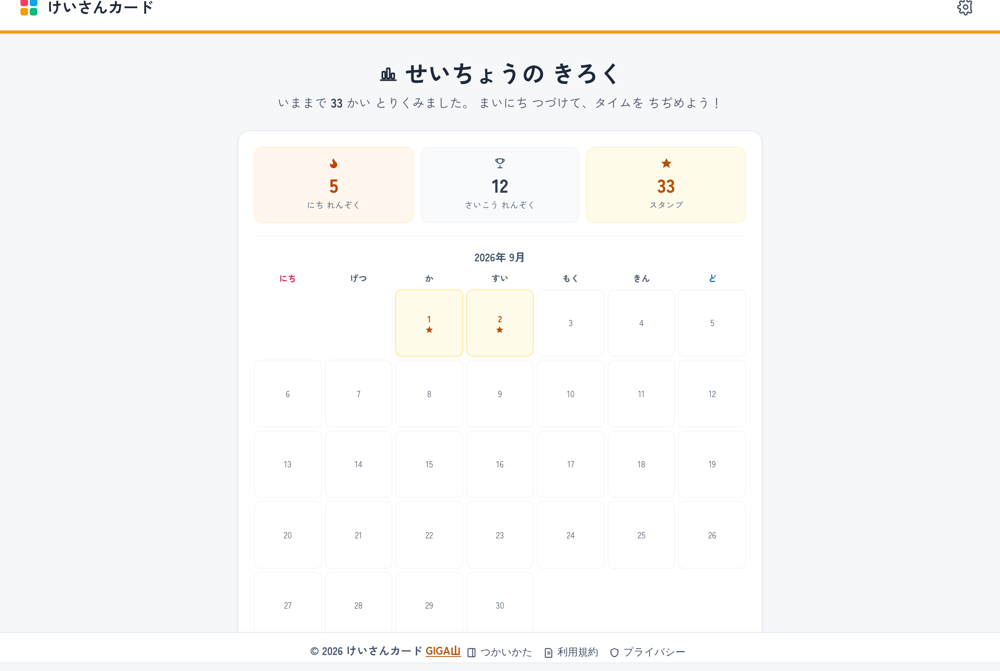

上から じゅんに ならんでいます。

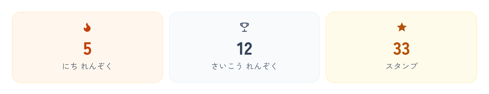

左から れんぞく、さいこう れんぞく、スタンプです。

### カレンダーで れんしゅうした日を 見る

3つの ますの 下に、カレンダーが あります。

れんしゅうした日には <ruby>星<rt>ほし</rt></ruby>が つきます。きょう まだ れんしゅうしていないときは、きょうの日の まわりだけが きいろい わくに なります。

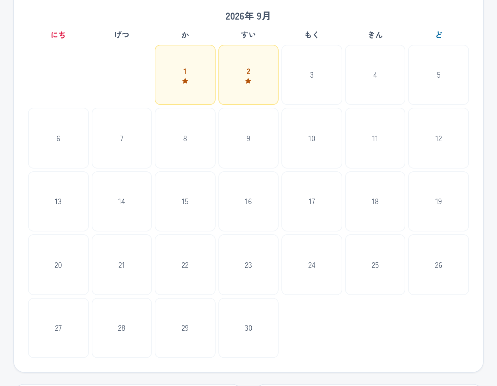

<ruby>星<rt>ほし</rt></ruby>の ついた日が、れんしゅうした日です。

出ているのは <ruby>今月<rt>こんげつ</rt></ruby>の ぶんだけです。先月までの ぶんは 出ませんが、「さいこう れんぞく」の <ruby>数字<rt>すうじ</rt></ruby>には 入っています。

### いろごとの かいすう・ベスト・ぼうグラフ

カレンダーの 下に、4つの いろの カードが 1つずつ ならびます。

- かいすう … その いろに とりくんだ かいすう（じゅんばんと バラバラの ぜんぶ）
- ベスト … いちばん はやかった タイム
- ぜんかい … この まえの タイム

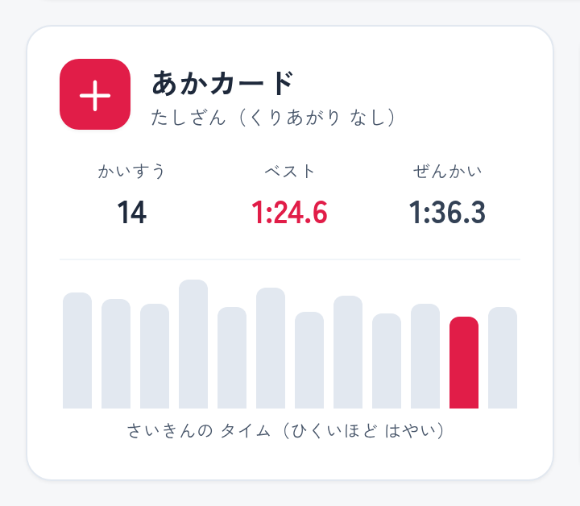

下の ぼうグラフは さいきんの タイムです。

ぼうグラフは、さいきんの 12かいぶんの タイムです。ぼうが ひくいほど はやい ということで、いちばん はやかった ぼうに いろが つきます。

見おわったら、いちばん 下の「もどる」を おします。

## せっていで 音を けす・きろくを けす

<ruby>画面<rt>がめん</rt></ruby>の 右上の はぐるまを おすと、せっていが ひらきます。2つの ことが できます。

### おと・バイブを <ruby>切<rt>き</rt></ruby>りかえる

いちばん 上の「おと・バイブ」を おすと、音と ふるえが 出るか 出ないかを かえられます。

はじめは 出るように なっています。右の まるが みどりのときは 出る、はいいろのときは 出ないです。音が にがてな子や、しずかに つかいたい ときは けしてください。

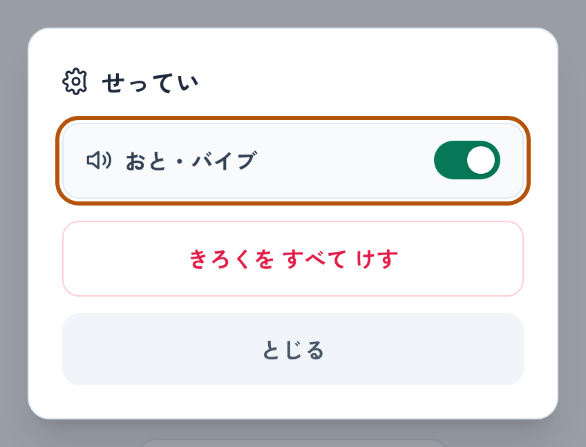

上が おと・バイブの <ruby>切<rt>き</rt></ruby>りかえです。

とじるときは いちばん 下の「とじる」を おします。キーボードの Esc でも とじます。

### 【！！】きろくを すべて けす

まん中の「きろくを すべて けす」を おすと、たしかめの 文が 出ます。

そこで「けす」を おすと、ベストタイム・かいすう・ぼうグラフ・れんぞくの きろく・カレンダー・スタンプが ぜんぶ きえます。もとには もどせません。

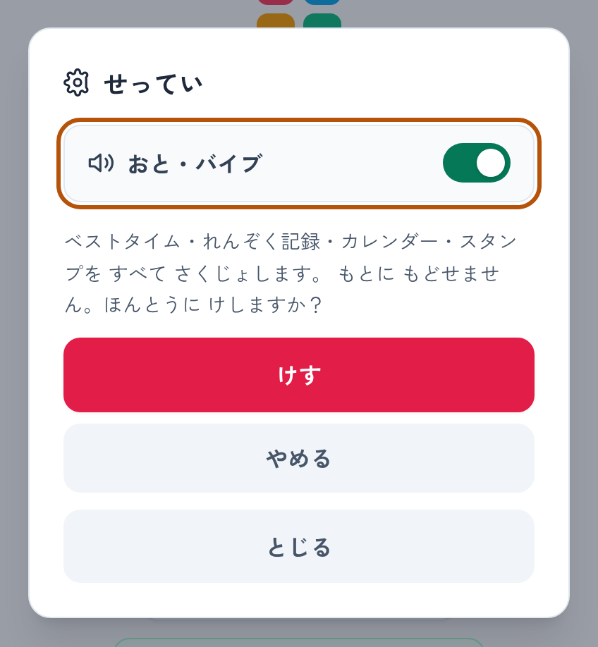

「やめる」を おせば きえません。

【！！】けす まえに たしかめること:

- けした きろくは、もとに もどせません
- おと・バイブの せっていは けしても のこります
- <ruby>学習<rt>がくしゅう</rt></ruby>の <ruby>記録<rt>きろく</rt></ruby>（あとの <ruby>章<rt>しょう</rt></ruby>）は、これでは きえません
- けすつもりが なければ、下の「やめる」を おしてください

## ホーム画面に 入れて、電波がなくても つかう（先生向け）

この章は、児童に配る前の準備をする先生に向けたものです。ホーム画面に入れておくと、毎回アドレスを打たなくてよくなり、電波がなくても開けるようになります。

### Chromebook・Windows・Android に入れる

さいしょの画面の「アプリとして インストール」を押してください。

ブラウザが入れられる状態なら、そのまま確認の画面が出るので「インストール」を押します。Chromebook ならランチャー（画面左下の丸いボタン）に、Windows や Android ならホーム画面にアイコンが増えます。

すぐに入れられないときは、かわりに手順の案内が出ます。案内の中身は、使っている端末に合わせて変わります。

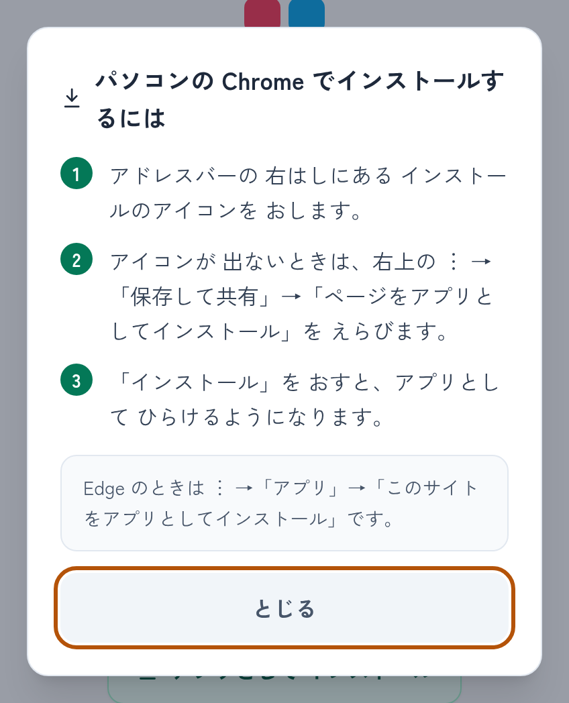

パソコンの Chrome で開いたときの案内です。

押しても何も出ないときは、たいていもう入っています。ランチャーやホーム画面で「けいさんカード」を探してみてください。

### iPad・iPhone に入れる

iPad の Safari には「インストール」のしくみがありません。共有メニューから追加します。

1. Safari でアプリを開いてください（Chrome ではできないことがあります）。
2. 画面の上（iPhone は下）にある共有ボタン（四角に上向きの矢印）を押してください。
3. メニューを下に動かして「ホーム画面に追加」を選んでください。
4. 右上の「追加」を押してください。ホーム画面にアイコンが増えます。

【！】覚えておいていただきたいこと:

- iPad ではホーム画面に追加することをおすすめします。Safari は 7 日使わないと保存した記録を消してしまうことがあり、ホーム画面から開いていればその影響を受けにくくなります
- アプリの中の「アプリとして インストール」を押すと、この手順の案内が出ます
- すでに追加ずみのときは、ボタンそのものが出ません

### つながっていないときの画面

一度開いたあとは、電波がなくても使えます。まだ一度も開いていない端末だけ、最初の 1 回をつながる場所で開いてください。

つながっておらず、アプリもまだ入っていないときは、次の画面が出ます。壊れたわけではありません。

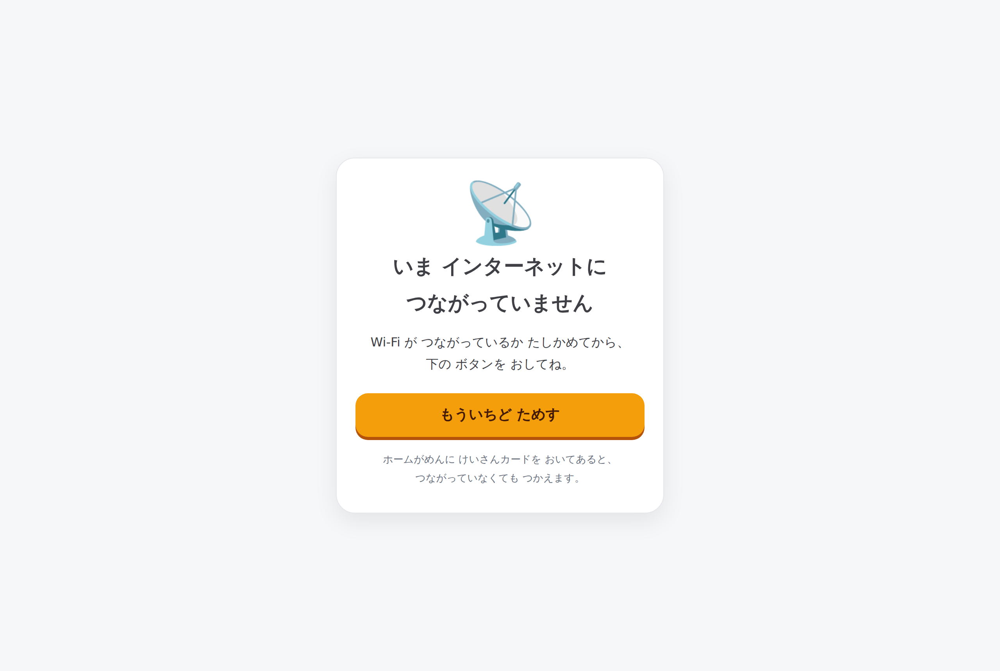

Wi-Fi を確かめてから「もういちど ためす」を押します。

## うまく いかないとき

こまったときは、まず この<ruby>章<rt>しょう</rt></ruby>を さがしてください。おおくの ことは、ここで なおります。

### <ruby>画面<rt>がめん</rt></ruby>が 白いまま 出てこない

いったん とじて、もう1かい ひらいてください。それでも 出ないときは、タブレットを さいきどうしてください。

アプリを うごかす ファイルは、字の<ruby>形<rt>かたち</rt></ruby>（<ruby>書体<rt>しょたい</rt></ruby>）も ふくめて ぜんぶ この中に 入っています。<ruby>外<rt>そと</rt></ruby>から とってくる ものは 1つも ないので、学校の ネットワークの せいで 白くなったり、字の<ruby>形<rt>かたち</rt></ruby>が かわったり することは ありません。

### 「あたらしい ばんが あります」と 出た

<ruby>直<rt>なお</rt></ruby>したはずなのに <ruby>画面<rt>がめん</rt></ruby>が <ruby>変<rt>か</rt></ruby>わらない ときは、<ruby>画面<rt>がめん</rt></ruby>の 下を 見てください。

「あたらしい ばんが あります」と 出ていたら、よこの「さいしんに する」を おします。おしたときだけ あたらしくなるので、おさないでいる あいだは、めくっている カードも はかっている タイムも きえません。れんしゅうの とちゅうで 出たときは、おわってから おしてください。

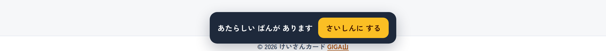

これが 出たら「さいしんに する」を おします。

出ていないのに <ruby>変<rt>か</rt></ruby>わらないときは、アプリを ぜんぶ とじてから ひらき<ruby>直<rt>なお</rt></ruby>してください。

### 「わかった」「もういちど」が おせない

こたえが 出る まえは、わざと おせないように してあります。

カードを タップして こたえを 見てからでないと、「わかった」も「もういちど」も、よこに はらう ことも できません。まず こたえを 見てください。

### タイマーが <ruby>止<rt>と</rt></ruby>まらない／のこりが へらない

まちがえた カードは <ruby>何回<rt>なんかい</rt></ruby>でも 出てきます。ぜんぶ せいかいするまで <ruby>終<rt>おわ</rt></ruby>わらない しくみです。

<ruby>時間<rt>じかん</rt></ruby>で <ruby>区切<rt>くぎ</rt></ruby>りたい ときは、<ruby>画面<rt>がめん</rt></ruby>の 左上の「やめる」を おしてください。

### まちがえて とじそうに なった

タブレットの「もどる」を 1かい おしただけでは とじません。

「もう1かい「もどる」で とじます」と 出て、つづけて もう1かい おしたときだけ とじます。

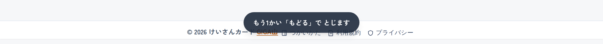

このあいだに <ruby>何<rt>なに</rt></ruby>もしなければ、そのまま つづけられます。

### きろくが きえてしまった

ブラウザの「<ruby>閲覧履歴<rt>えつらんりれき</rt></ruby>データの<ruby>削除<rt>さくじょ</rt></ruby>」で サイトの データを けすと、きろくも きえます。

iPad の Safari は、7日 つかわないと きろくを けすことが あります。ホーム<ruby>画面<rt>がめん</rt></ruby>に 入れておくと、おきにくくなります。

### 字が 小さくて 見えない

<ruby>画面<rt>がめん</rt></ruby>を ゆびで ひろげて 大きくできます。このアプリは 大きくすることを とめていません。

カードの しきは、<ruby>画面<rt>がめん</rt></ruby>の 大きさに あわせて じどうで 大きくなります。

### それでも なおらないとき

まず、この アプリを おしえてくれた 先生か、学校の 中の くわしい 先生に <ruby>聞<rt>き</rt></ruby>いてください。

それでも わからないときは、この ページの いちばん 下に ある <ruby>問<rt>と</rt></ruby>い<ruby>合<rt>あ</rt></ruby>わせ先から きいてください。

## 学習の記録がどこへ行くのか（先生向け）

この章は、児童の記録の扱いを保護者や管理職に説明するときのためのものです。名前・出席番号・メールアドレスは一切扱いません。

### 記録は端末の中に残り、サーバーへは送られない

学習の記録は、その端末のブラウザの中（localStorage）に残ります。制作者が運用するサーバーはなく、記録が制作者の手元に集まることはありません。

記録は、GIGA山の学習アプリ共通のかたちで保存され、同じ端末の中にある「記録ボックス」（gamification.giga-school.com）へ写されます。写す先も同じ端末の中の別の置き場で、インターネットの向こうへ送っているわけではありません。集めて使うときは、先生が集計のページから明示的に行います。

このアプリは「だれが使ったか」を知りません。名前も出席番号も持たないので、そのまま電子黒板に映しても個人情報は出ません。

### 記録に残る中身と、たまる上限

1 回の練習ごとに、次のようなことがらが残ります。

- どのカード・どのモードを、いつ、どれだけの時間やったか
- 1 回目で正解した枚数（いちばん大事な数字です）
- カード 1 枚ごとの正誤・答えた回数・かかった時間

途中でやめた分も残します。「むずかしすぎる」「量が多すぎる」の大事な合図だからです。1 枚も答えずにやめたときは残しません。5 分以上ほかの画面へ行ったときも、そこでいったん区切ります。待っていた時間は学習の時間に入りません。

古いものから順に消えるので、端末には最大 500 件までたまります。大事な記録は、たまりすぎる前に集計のページで集めてください。

### 記録の受け渡し口について

このアプリには、記録を集計のページへ渡すためだけのページ（records-export.html）があります。児童が開く画面ではありません。

先生が直接開いても、次の説明が出るだけで、記録が書きかわったり消えたりすることはありません。

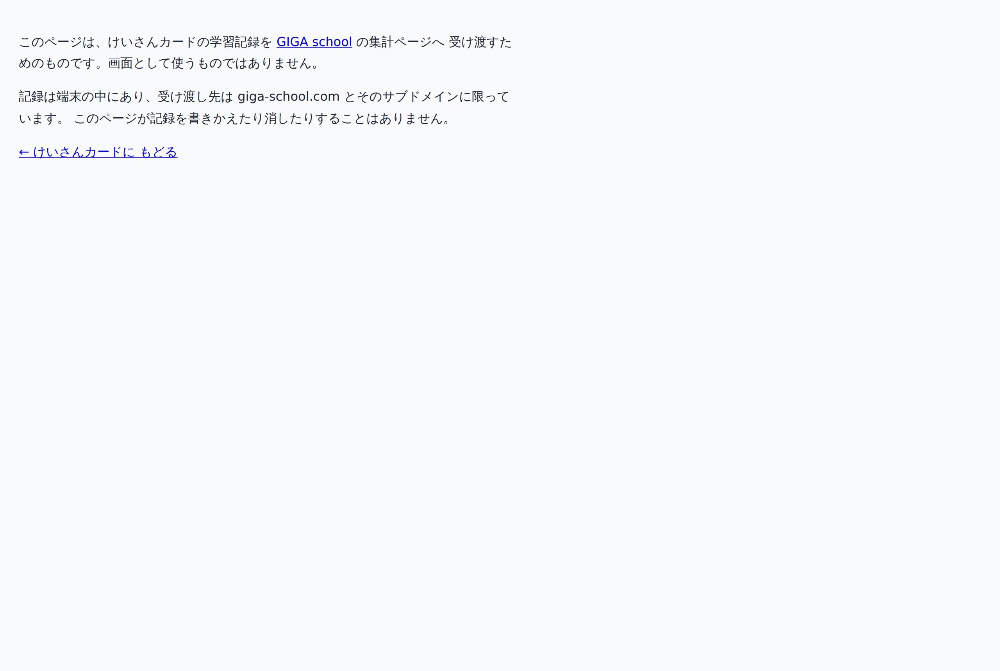

集計のページから呼ばれるためのページです。

設定の「きろくを すべて けす」を押しても、この学習の記録は消えません。まだ集めていない記録が消えてしまうため、わざと分けてあります。

### 一斉授業で見せるとき

カードの式は画面の大きさに合わせて自動で大きくなるので、電子黒板につないでも後ろの席から読めます。

このアプリは、紙に印刷して配るためのものではありません。画面でカードをめくるものとして作ってあります。児童が一人ずつ自分の端末で取り組み、記録もその端末に残ります。
