# 教室で使えるかもしれないもの作り #◯ 「計算カード、ぜんぶ聞いてあげられない」タイムと伸びが自動で残る計算カードアプリ「けいさんカード」

## 🏫 はじめに

1年生の計算カード、先生方はどうされていますか。

輪ゴムでとめたカードの束を宿題で持ち帰らせて、おうちの人に聞いてもらう。学校では朝の会や、授業のはじめの数分で。やることは決まっているのに、いちばん大事なところが手つかずになりがちではないでしょうか。

一人ずつタイムを計ってあげられない、ということです。

35人の教室で、一人ひとりの前にすわって、カードをめくって、こたえを聞いて、時計を見て。どう考えても回りません。だから多くの場合、家庭にお願いすることになります。でも、毎晩ていねいに聞いてくれるご家庭もあれば、そうできないご家庭もあります。子どものがんばりが、家の事情で見えたり見えなかったりする。ここがずっと気になっていました。

それに、カードそのものの管理もあります。輪ゴムが切れて床にばらまく。何枚かなくす。友だちのと混ざる。休み時間のたびに「カードひろって」と言っている自分に気づいて、これは算数の時間なのだろうかと思ったこともあります。

そこで、計算カードをまるごとタブレットの中に入れてみました。「けいさんカード」というアプリです。

https://gigayama.github.io/Keisan-Card/

ひらくだけで使えます。アカウントもログインもいりません。こたえた時間は自動で計られ、その端末の中に記録がたまっていきます。先生が横についていなくても、子どもは自分でめくって、自分のタイムが縮んでいくのを見ることができます。

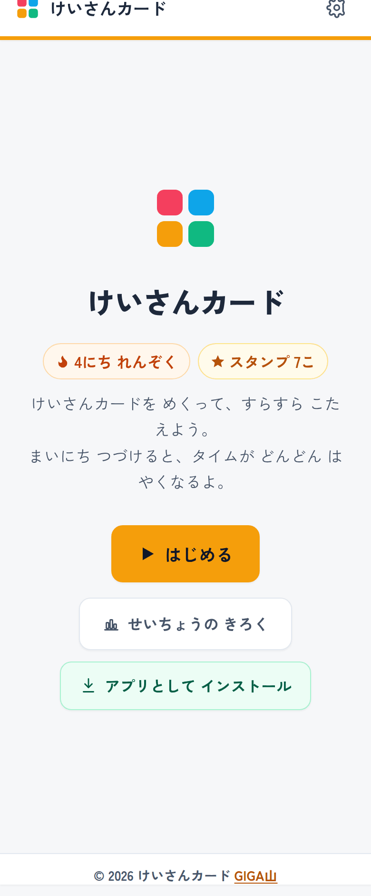

タイトル画面。れんぞくの日数とスタンプの数が、ひらいた瞬間に目に入ります。

## 📱 このアプリでできること

まず、カードは4色です。実物の計算カードと同じ分けかたにしました。

あかカードは、くりあがりのないたしざんが54枚。あおカードは、くりさがりのないひきざんが54枚。きいろカードは、くりあがりのあるたしざんが36枚。みどりカードは、くりさがりのあるひきざんが36枚。ぜんぶで180枚です。

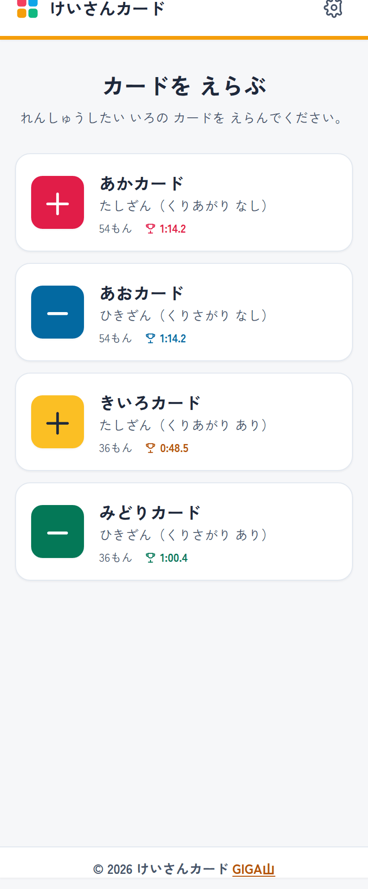

カードをえらぶ画面。それぞれ何枚あるかと、その色のベストタイムが並びます。

学校で使っている実物のカードと色が同じなので、「あかカードやっておいて」がそのまま通じます。子どもに新しい言葉をおぼえてもらう必要がありません。ここは、あたらしいものを教室に持ちこむときにいちばん大事なところだと思っています。

カードをえらぶと、モードを聞かれます。

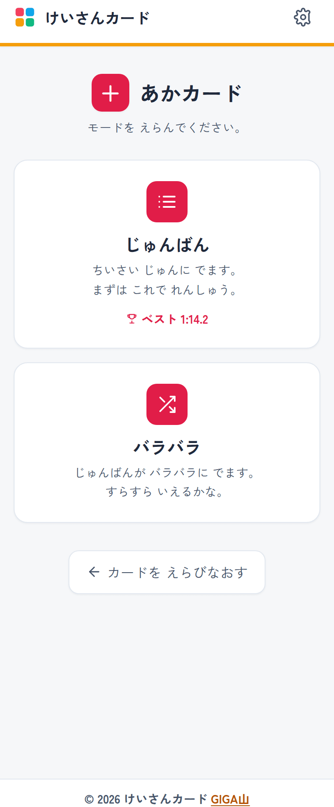

じゅんばんとバラバラの2つ。ベストタイムが出ているのは、前にやったことのあるモードです。

じゅんばんは小さい順に出てきます。まずはこれで、ひとつずつ確かめながら。バラバラはシャッフルされて出てきます。順番でおぼえてしまった子も、これだと通用しません。実物のカードでも、慣れてきたらシャッフルして使いますよね。それと同じです。

はじまると、画面いっぱいにカードが出ます。

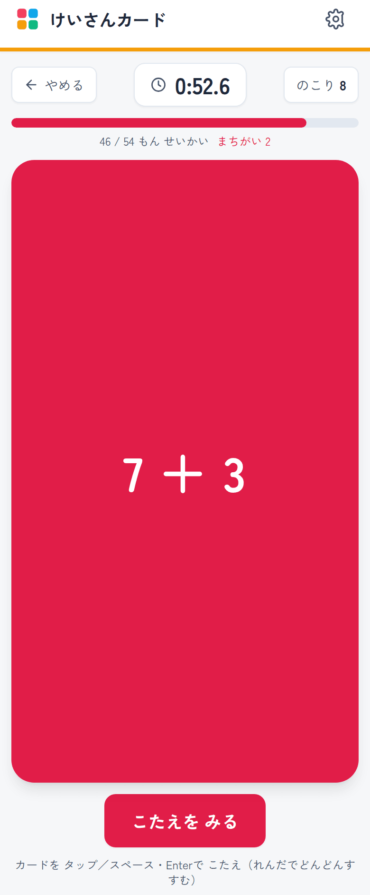

おもてには式だけ。数字は画面の大きさに合わせて自動で大きくなるので、電子黒板につないでも、うしろの席から読めます。

こたえが思いうかんだら、カードをタップします。

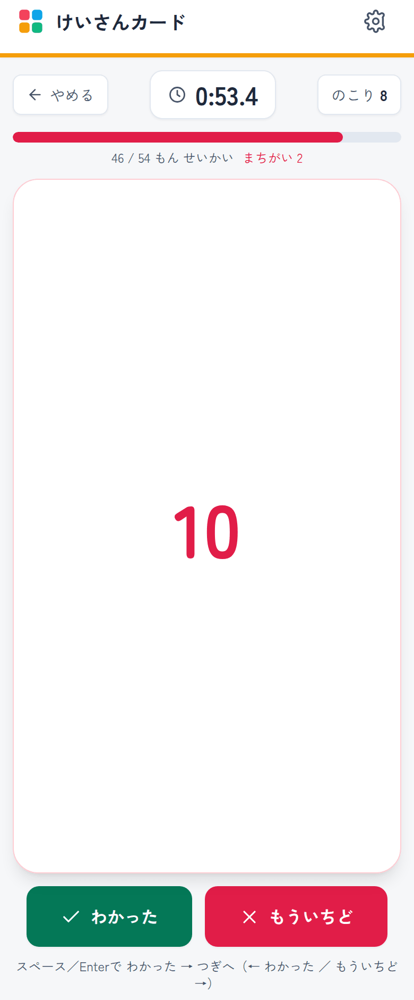

うらには、こたえだけが出ます。上のバーで、いま何枚できたか、まちがいが何回あったかが分かります。

ここで「わかった」か「もういちど」を選ぶのですが、選びかたを3通り用意しました。

ひとつめは、指で払う操作です。カードを左に払えば「わかった」、右に払えば「もういちど」。実物のカードを左右に仕分けるのと同じ手の動きになります。

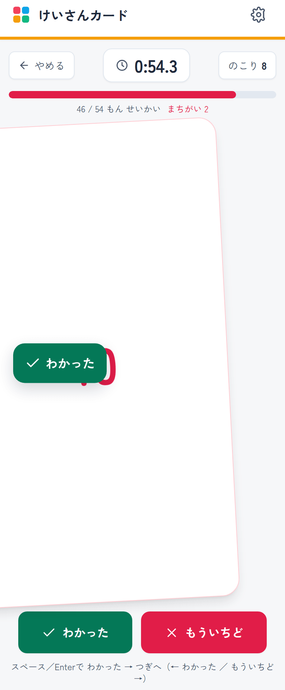

左へ払っている途中の画面です。カードがかたむいて、「わかった」のラベルが出ます。手をはなす前に、どちらに仕分けようとしているかが分かります。

ふたつめは、画面の下のボタンです。指の操作が苦手な子や、まだ加減の分からない子はこちらを使います。

みっつめは、キーボードです。スペースキーかEnterキーを連打すると「めくる、わかった、つぎへ」とどんどん進みます。Chromebookのようにキーボードのある端末だと、これがいちばん速い。まちがえたときだけ右の矢印キーを押します。慣れた子はこれで気持ちよく回していけるはずです。

そして、このアプリのいちばん大事なきまりがひとつあります。

まちがえたカードは、最後にもう一度出てきます。ぜんぶできるまで終わりません。

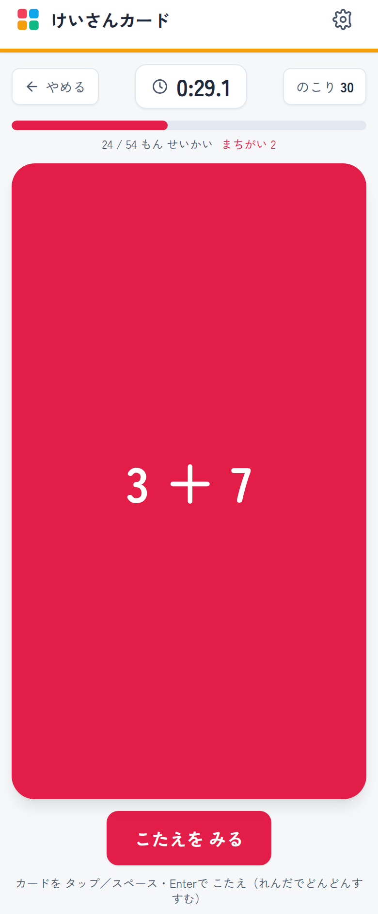

とちゅうの画面。54枚のうち24枚できて、まちがいが2回。すすみ具合のバーと数が、ずっと画面の上に出ています。

実物の計算カードでも、まちがえたカードは束にもどしてもう一度めくりますよね。それをそのまま持ちこみました。ここを「1回まちがえたらおしまい」にしてしまうと、点数を取りにいくゲームになってしまいます。できるようになるまでやる。それが計算カードだと思うので、そこは動かしませんでした。

ぜんぶできると、結果の画面になります。

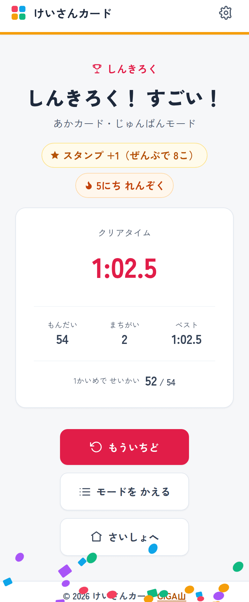

ベストを更新したときの結果画面。クリアタイム、もんだいの数、まちがいの数、ベストタイム、そして1かいめでこたえられた枚数が並びます。

くりあがりとくりさがりのカードも、もちろん同じように使えます。

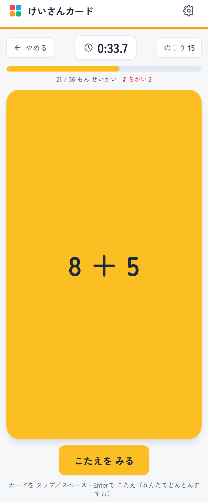

きいろカードは、くりあがりのあるたしざん。1年生がつまずきやすいところです。

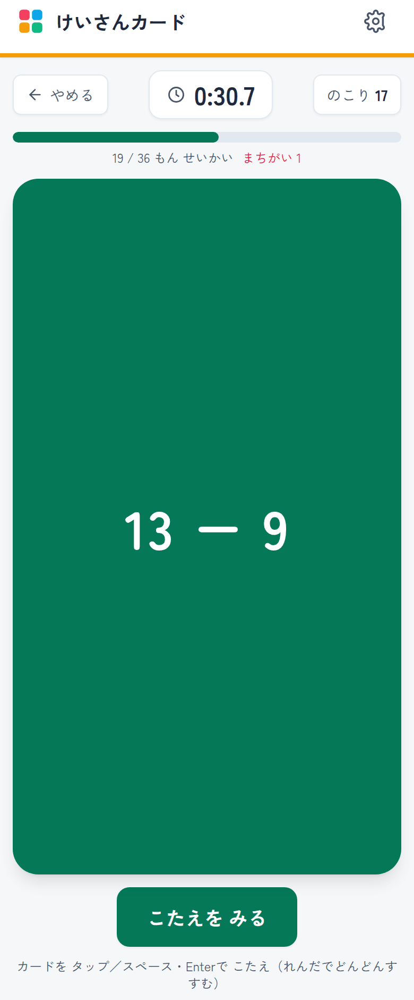

みどりカードは、くりさがりのあるひきざん。ここが考えずに出てくるようになると、2年生からが楽になると思います。

## 🔥 まいにち つづけたくなる しくみ

計算カードは、一度にたくさんやるより、毎日ちょっとずつのほうが効きます。それは先生方もご存じのとおりです。問題は、子どもが毎日やりたくならないことでした。

そこで、続けたくなる仕掛けをいくつか入れました。

れんぞく記録です。毎日取り組むと日数がのびていきます。1日あくと0にもどります。がんばりカレンダーには、れんしゅうした日に星がつきます。スタンプは、1回終えるごとに1つたまっていきます。

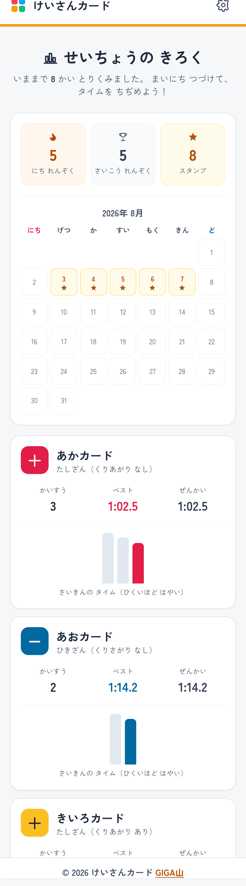

せいちょうの きろく の上のほう。れんぞく日数、これまでのさいこう記録、スタンプの数、そして今月のカレンダーです。

1日あくとリセットというのは、けっこう厳しい決まりです。作るときに、ゆるくしようかとずいぶん迷いました。3日までは大目に見る、といった作りにもできます。

でも、ゆるくすると数字の意味がなくなると思ってやめました。「5にち れんぞく」と出ているとき、それは本当に5日続けたということです。だから子どもはそれを守ろうとするし、途切れたときにくやしいと感じる。くやしいと思えるくらいには、意味のある数字にしておきたかったのです。

もっとも、休んだ日があっても、カレンダーの星と、これまでのさいこう記録は消えません。「0にもどった」だけが残る作りにはしていないつもりです。

クリアしたときには紙ふぶきが出て、ほめ言葉が出ます。ベストを更新したときは、いつもと違う出かたをします。音とふるえもつきます。

音とふるえについては、せってい画面でいつでも切れるようにしました。

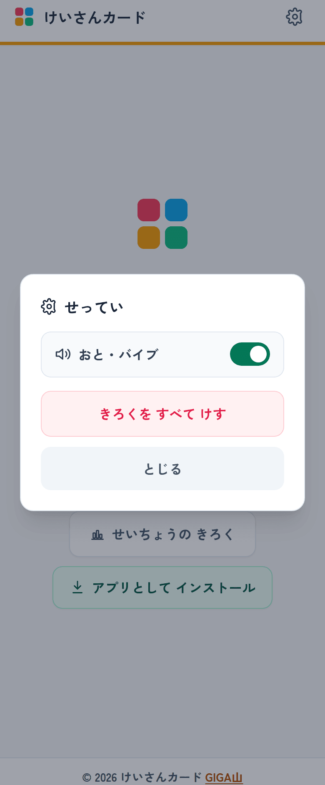

せっていの中身は2つだけ。おと・バイブの切りかえと、記録を消すことです。

教室で35人が同時に使うと、正解の音が35個ばらばらに鳴ります。それがうるさいと感じる子もいます。音や振動が苦手な子もいます。「みんなでやるときは音を切る」と決めておけるように、切りかえは1タップにしました。

## 📊 「1かいめで せいかい」というものさし

先ほど書いたとおり、このアプリはぜんぶ正解するまで終わりません。ということは、正解した数はいつもカードの枚数と同じになります。54枚のカードなら、いつでも54問正解。これでは力の目やすになりません。

そこで、もうひとつの数字を出すことにしました。「1かいめで せいかい」です。

一度もまちがえずに答えられたカードが何枚あったか。結果の画面に、54枚中52枚、というように出ます。これが、いまの力に近い数字だと思っています。

なぜこれを足したかというと、タイムだけを見せると、当てずっぽうでめくる子が出てくると思ったからです。とにかく速く「わかった」を押していけばタイムは縮みます。でもそれでは練習になりません。1かいめで何枚いけたかを同じ画面に並べておけば、そちらも気になります。速さと正確さの両方を見てもらうための工夫です。

タイムの伸びは、せいちょうのきろく画面で見られます。

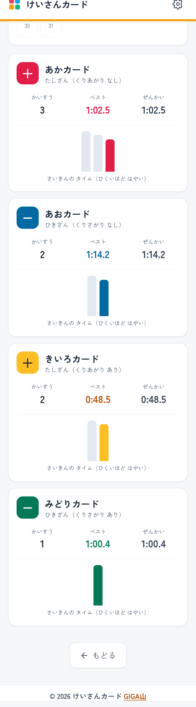

同じ画面を下まで送ったところ。カードごとに、取り組んだ回数、ベストタイム、前回のタイム、そして最近のタイムの棒グラフが並びます。棒が低いほど速いという見かたです。

この棒グラフを入れたのは、1年生には数字だけだとピンとこないと思ったからです。「1分24秒が1分3秒になった」と言われても、速くなったのかどうか、すぐには分かりません。棒が短くなっていくのが目に見えれば、説明はいりません。

先生にとっても、この画面はそのまま声かけの材料になると思います。「あかカード、こんなにやったんだね」「きいろカード、この前より速くなってる」。カードの色ごとに分かれているので、どこでつまずいているかも見当がつきます。あかとあおはすらすらなのに、きいろだけタイムが伸びない。そういう子には、くりあがりのところをもう一度見てあげる。そんな使いかたができればいいなと思って作りました。

## ✨ 導入のメリット

三つのいいことが期待できます。

一つ目は、先生が一人ずつ聞いてまわらなくてよくなることです。タイムを計るのも、まちがいを数えるのも、記録を残すのもアプリの仕事になります。先生は、教室を歩きながら子どもの手もとを見ていられます。丸付けと計測から手がはなれると、それだけで見えてくるものがあると思います。

二つ目は、子どもが自分で自分の伸びを見られることです。棒グラフが短くなっていくのは、ほめられるのとは別のうれしさがあるはずです。「先生に速いと言われたから速い」ではなく、「自分で見て、速くなったと分かった」。この順番のほうが、次も自分からやろうという気持ちにつながるのではないかと思っています。

三つ目は、家庭にお願いする量を減らせることです。学校のすきま時間だけで、聞いてもらうところまで完結します。おうちの人に聞いてもらえる子と、そうでない子の差が、練習量の差にならずにすみます。宿題として持ち帰るときにも、端末があれば同じことができます。

もちろん、実物のカードのよさもあります。手でめくる感触や、おうちの人と一緒にやる時間は、画面では置きかえられません。どちらかをやめるという話ではなく、回らなかったところをアプリに任せる、というつもりで作りました。

## 🛠️ 【管理者向け】導入手順

情報担当の先生に確認されそうなことを、先にまとめておきます。

まず、アドレスはこれひとつです。

https://gigayama.github.io/Keisan-Card/

校内のフィルタリングで許可が必要なのは gigayama.github.io だけです。アプリを動かすためのプログラムは、すべてこのアドレスの中に入っています。以前は外部の配信サービスから読みこむ作りだったのですが、学校のネットワークでそこがふさがれていると画面がまっ白になってしまいました。しかも原因がアプリの外にあるので、先生が調べても分かりません。そこで全部を自分側に置き直しました。いま、外部から読みこむプログラムは0バイトです。

外への通信で残っているのは、文字の書体を取ってくる fonts.googleapis.com と fonts.gstatic.com だけです。これは見た目だけの話なので、ふさがれていても動きます。書体が端末に入っているものに変わるだけです。許可できるなら、丸みのある読みやすい書体で表示されます。

個人情報については、次のとおりです。

アカウントもログインもありません。氏名、出席番号、メールアドレスは一切あつかいません。アプリは「だれが使ったか」を知りません。記録はその端末の中だけに残り、どこにも送っていません。保護者への説明が必要なときは、この3行をそのままお使いいただけます。

そのうえで、共用の端末についてはひとつ気をつけてください。

記録は端末ごとに残ります。1台を何人かで使いまわすと、れんぞく記録もベストタイムも混ざります。一人1台の端末で使うことを前提にした作りです。共用のタブレットで使うときは、記録のところは見ないものとして、その日の練習だけに使っていただくのがよいと思います。

端末へのインストールの手順は次のとおりです。入れておくと、毎回アドレスを打たなくてよくなり、電波がなくてもひらけるようになります。

1. アプリをひらきます。
2. タイトル画面の「アプリとして インストール」をおします。
3. 出てきた画面で「インストール」をおします。
4. Chromebookならランチャーに、iPadならホーム画面に、けいさんカードが増えます。

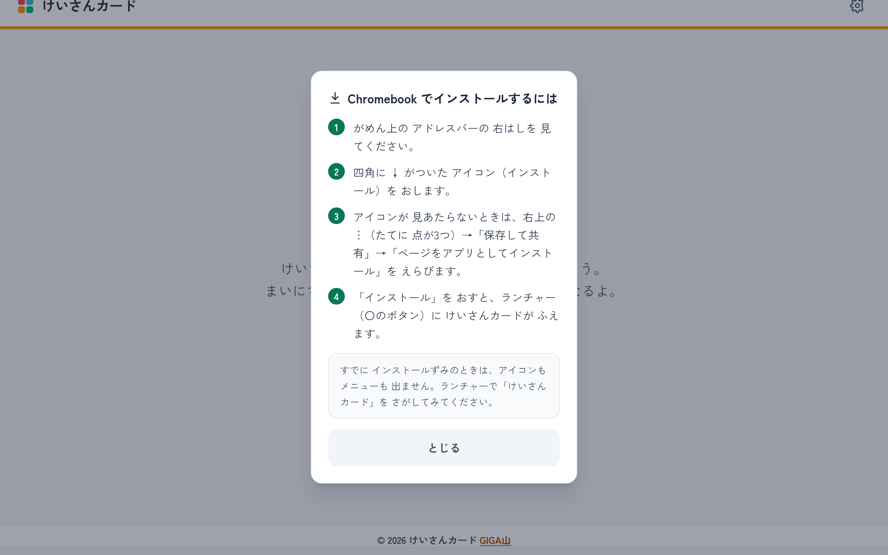

すぐにインストールできない端末では、やり方の画面が出ます。Chromebookで開いたときはこの案内になります。

ボタンをおしても何も出ないときは、たいていもう入っています。ランチャーやホーム画面をさがしてみてください。

iPadのSafariには、Chromeのようなインストールのしくみがありません。共有ボタンから「ホーム画面に追加」を選びます。iPadでは、これをやっておくことをおすすめします。Safariは7日間使わないと保存した記録を消してしまうことがあり、ホーム画面からひらいていると、その影響を受けにくくなるためです。

一度ひらいたあとは、電波がなくても動きます。まだ一度もひらいていない端末だけ、最初の1回をつながる場所でひらいてください。

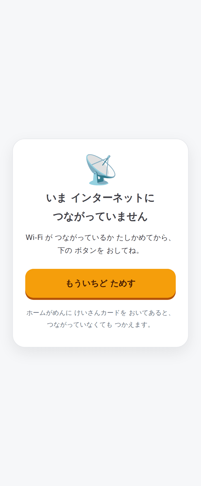

つながっていないうえに、まだ一度もひらいていない端末では、この画面が出ます。壊れたわけではありません。

アプリを新しくしたときは、画面の下に「あたらしい ばんが あります」と出ます。「さいしんに する」をおすまで切りかわらないので、子どもが練習している最中に画面が入れかわることはありません。

文字が小さくて見えない子のために、画面を指でひろげての拡大は禁止していません。誤ってズームしてしまう問題は別の方法でふせいでいます。

電子黒板やパソコンにつないだときは、式が画面の大きさに合わせて自動で大きくなります。

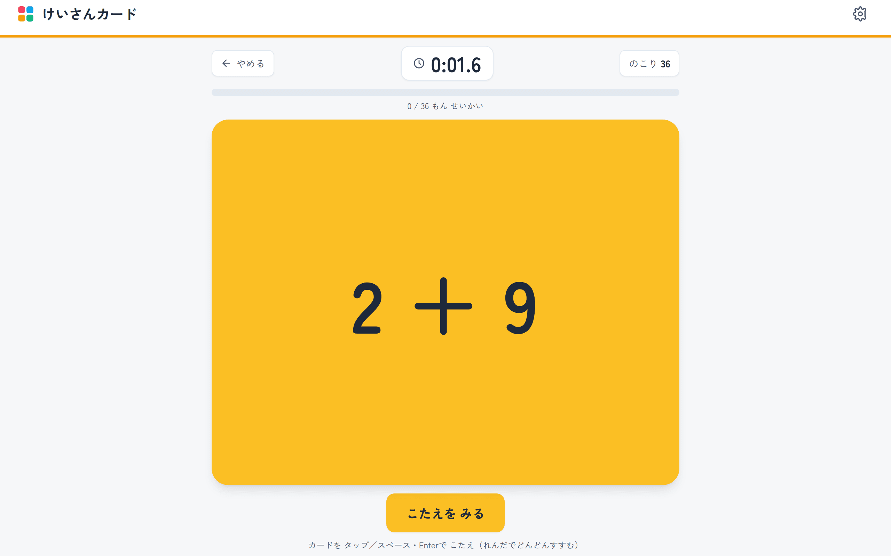

横長の画面ではこうなります。うしろの席からも読める大きさです。子どもの名前をあつかわないので、そのまま提示しても個人情報は出ません。

記録をまとめて消したいときは、せってい画面の「きろくを すべて けす」から行います。もとにもどせないので、確認の画面をはさんであります。

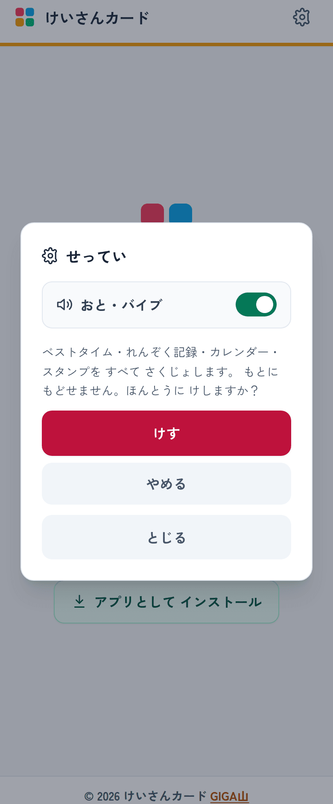

消す前に、何が消えるかを書いて確認します。学年のおわりに端末を返すときなどにお使いください。

## 📖 【利用者向け】使い方のガイド

子どもたちに配るときは、この順番で伝えてください。

1. 配られたアドレスをひらきます。ホーム画面にアイコンがあるときは、それをおします。
2. 「はじめる」をおします。
3. カードのいろをえらびます。あか、あお、きいろ、みどりの4つです。
4. モードをえらびます。はじめは「じゅんばん」がおすすめです。
5. カードが出たら、こたえを考えます。
6. こたえが分かったら、カードをタップします。うらのこたえが出ます。
7. あっていたら「わかった」、まちがえていたら「もういちど」をおします。指でカードを左にはらうと「わかった」、右にはらうと「もういちど」です。
8. まちがえたカードは、さいごにもう一度出ます。ぜんぶできるまで終わりません。
9. ぜんぶできると、タイムが出ます。
10. タイトル画面の「せいちょうの きろく」で、これまでのタイムを見られます。

キーボードのある端末では、こちらのほうが速く進みます。

1. スペースキーかEnterキーをおすと、カードがめくれます。
2. もう一度おすと「わかった」になって、つぎのカードに進みます。
3. つまり、あっているあいだは連打でどんどん進みます。
4. まちがえたときだけ、右の矢印キーをおします。

うまくいかないときは、次を確かめてください。

1. 画面が白いままのときは、いったんとじて、もう一度ひらきます。
2. 字の形がいつもとちがうときは、書体が届いていないだけです。動作に問題はありません。
3. タイマーが止まらないときは、カードのこたえを見たあとで「わかった」か「もういちど」をおしていない状態です。
4. 直したはずなのに変わらないときは、画面の下の「さいしんに する」をおします。

なお、端末の「もどる」の操作や、画面のふちからのスワイプで、1つ前の画面にもどれます。ただし1回ではアプリが終わりません。タイトル画面でもどる操作をすると「もう1かい「もどる」で とじます」と出て、続けてもう一度したときだけとじます。子どもがまちがえてとじてしまうことをふせぐためです。

## 📝 まとめ

このアプリを作りながら考えていたのは、計算カードを速く終わらせる方法ではありませんでした。

計算カードを聞いてあげる時間を、機械に渡してしまえないか、ということでした。

タイムを計る、まちがいを数える、記録に残す。この3つは、正直なところ、先生でなくてもできます。というより、先生がやると35人ぶんで一日が終わってしまいます。そこをアプリに任せて、空いた時間で子どもの手もとを見ていられたら。「いま、ちょっと考えたね」とか「そこ、指で数えなくなったね」とか、そういうことに気づけたら。それがいちばんやりたかったことです。

ICTを入れると、たしかに手間は減ります。でも、減らすこと自体が目的になってしまうと、なんのために減らしたのか分からなくなります。減らしたぶんで何を見るか。そこまでを込みで考えたくて、記録の画面には数字を並べるだけでなく、声をかける材料になりそうなものを置いたつもりです。

うまくいくかどうかは、正直なところ、これから教室で確かめていくことだと思っています。1年生が毎日ひらいてくれるのか、れんぞく記録が続くのか、棒グラフを見て喜んでくれるのか。そうなればいいと思って作りました。もし試してくださる先生がいたら、どうだったか教えていただけるとうれしいです。

このアプリは、GitHubというところで中身を全部公開しています。うちの学校用に色を変えたい、カードの種類を足したいということがあれば、自由に持っていって直していただいてかまいません。

https://github.com/GIGAyama/Keisan-Card

一歩踏み出そうとする先生を、私はいつでも全力で応援しています。
